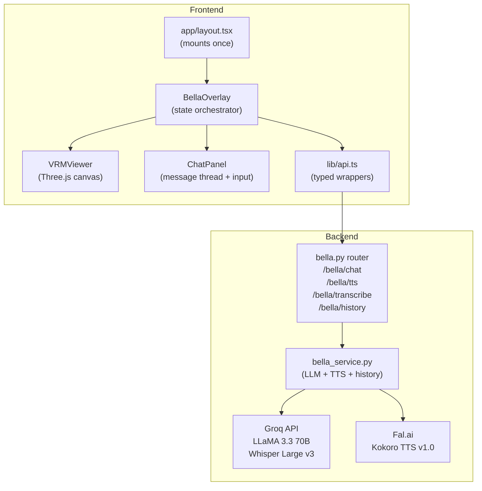
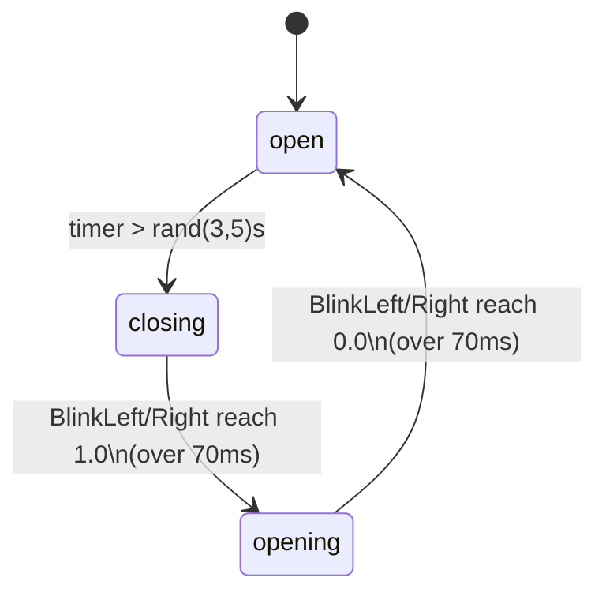
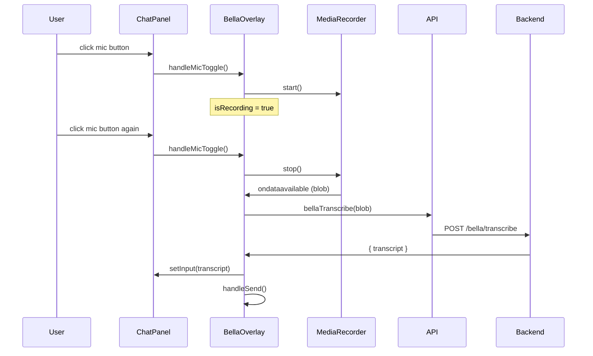

# Design Document: Bella VRM Avatar

## Overview

Bella is a persistent 3D VRM anime assistant rendered in the browser via Three.js and `@pixiv/three-vrm`. She lives in a floating overlay (`BellaOverlay`) mounted once in `app/layout.tsx`, persisting across all client-side navigations. The feature encompasses:

- **VRM rendering pipeline** — Three.js scene, camera, lighting, OrbitControls
- **Animation system** — idle sway, auto-blink state machine, lip sync
- **Emotion expressions** — four named states mapped to VRM blend shapes
- **Chat panel UI** — message thread, typing indicator, STT mic input
- **Backend integration** — LLM chat via Groq, TTS via Fal.ai Kokoro, STT via Groq Whisper

The `BellaOverlay` component already exists at `frontend/components/bella/BellaOverlay.tsx` with a working skeleton. This design specifies the complete, production-ready implementation.

---

## Architecture



**Key architectural decisions:**

- `VRMViewer` is a pure imperative Three.js component — it owns the WebGL context and animation loop. React props (`emotion`, `isTalking`) are read via refs inside the loop to avoid stale closures.
- `BellaOverlay` owns all application state (messages, emotion, talking, loading). It passes only the minimal props down to `VRMViewer`.
- The VRM model is loaded once on mount and never reloaded when the chat panel toggles.
- TTS audio is played via the Web Audio API / `HTMLAudioElement` from a base64 response. If TTS fails, a timer-based fallback drives `isTalking`.
- STT uses `MediaRecorder` to capture mic audio as a WebM blob, then POSTs to `/bella/transcribe`.

---

## Components and Interfaces

### BellaOverlay (frontend/components/bella/BellaOverlay.tsx)

Top-level orchestrator. Manages all state and coordinates VRMViewer + ChatPanel.

```typescript
// State
open: boolean                    // overlay expanded vs. floating button
chatOpen: boolean                // chat panel visible
messages: Message[]              // full session history
emotion: EmotionState            // drives VRMViewer expression
thinking: boolean                // awaiting LLM response
isTalking: boolean               // drives lip sync
vrmLoaded: boolean               // controls loading shimmer
input: string                    // chat text input
isRecording: boolean             // mic recording active

// Key handlers
handleSend()                     // POST /bella/chat → addBellaMessage
handleMicToggle()                // start/stop MediaRecorder → POST /bella/transcribe
addBellaMessage(text, emotion)   // append message + trigger TTS + set isTalking
playTTS(text)                    // POST /bella/tts → HTMLAudioElement.play()
```

### VRMViewer (inline in BellaOverlay.tsx)

Imperative Three.js component. All animation logic runs inside `requestAnimationFrame`.

```typescript
interface VRMViewerProps {
  emotion: EmotionState
  isTalking: boolean
  onLoaded: () => void
}
```

Internal refs (not React state — avoids re-renders):
- `vrmRef` — loaded VRM instance
- `rendererRef`, `sceneRef`, `cameraRef` — Three.js objects
- `frameRef` — rAF handle for cleanup
- `blinkStateRef`, `blinkTimerRef` — blink state machine
- `lipTimerRef`, `lipOpenRef` — lip sync toggle
- `emotionRef`, `isTalkingRef` — mirrors of props read inside rAF loop

### ChatPanel (inline in BellaOverlay.tsx)

Stateless display component driven by BellaOverlay props. Renders:
- Scrollable message thread (user right-aligned, bella left-aligned)
- Animated three-dot typing indicator when `thinking`
- Text input + send button
- Microphone button with recording indicator

### Backend: bella.py router

```python
POST /bella/chat
  body: { message: str, session_id: str }
  response: { reply: str }

POST /bella/tts
  body: { text: str }
  response: audio bytes (audio/mpeg) or { audio_b64: str }

POST /bella/transcribe
  body: multipart/form-data { audio: File }
  response: { transcript: str }

GET /bella/history
  query: session_id: str
  response: { messages: [{ role: str, text: str, timestamp: str }] }
```

### Backend: bella_service.py

```python
class BellaService:
    async def chat(message: str, session_id: str) -> str
    async def synthesize_speech(text: str) -> bytes
    async def transcribe_audio(audio_bytes: bytes, filename: str) -> str
    def get_history(session_id: str) -> list[dict]
```

---

## Data Models

### Frontend

```typescript
interface Message {
  id: string           // crypto.randomUUID()
  role: 'user' | 'bella'
  text: string
  timestamp: Date
}

type EmotionState = 'neutral' | 'thinking' | 'happy' | 'celebrate'

type BlinkState = 'open' | 'closing' | 'opening'
```

### Backend (Pydantic v2)

```python
class ChatRequest(BaseModel):
    message: str
    session_id: str = ""

class ChatResponse(BaseModel):
    reply: str

class TTSRequest(BaseModel):
    text: str

class TranscribeResponse(BaseModel):
    transcript: str

class HistoryResponse(BaseModel):
    messages: list[HistoryMessage]

class HistoryMessage(BaseModel):
    role: str   # "user" | "bella"
    text: str
    timestamp: str
```

### Session History Storage

Chat history is stored in-memory in `bella_service.py` as a dict keyed by `session_id`. Each entry is a list of `{"role": str, "text": str, "timestamp": str}` dicts. This is sufficient for the browser session scope — no persistence across server restarts is required.

```python
_history: dict[str, list[dict]] = {}
```

---

## Animation System Design

### Idle Animation

Three sinusoidal bone rotations applied every frame using `clock.elapsedTime`:

| Bone | Axis | Formula |
|------|------|---------|
| Spine | Z | `sin(t * 0.8) * 0.02` |
| Spine | X | `sin(t * 0.5) * 0.01` |
| Head | Y | `sin(t * 0.4) * 0.08` |
| Head | X | `sin(t * 0.3) * 0.04` |
| LeftUpperArm | Z | `0.6 + sin(t * 0.6) * 0.03` |
| RightUpperArm | Z | `-(0.6 + sin(t * 0.6 + 1) * 0.03)` |

### Auto-Blink State Machine



Expression values during transitions:
- `closing`: `v = clamp(blinkTimer / 0.07, 0, 1)` → set BlinkLeft + BlinkRight to `v`
- `opening`: `v = 1 - clamp(blinkTimer / 0.07, 0, 1)` → set BlinkLeft + BlinkRight to `v`

### Lip Sync

When `isTalking` is true, every 100ms toggle `Aa` expression between `rand(0.4, 0.8)` and `0`. When `isTalking` becomes false, immediately set `Aa` to `0`. Lip sync runs independently of blink — both write to different expression slots so there is no conflict.

### Emotion → Expression Mapping

| EmotionState | Happy | Relaxed | Surprised |
|---|---|---|---|
| `neutral` | 0 | 0 | 0 |
| `thinking` | 0 | 0.5 | 0 |
| `happy` | 1 | 0 | 0 |
| `celebrate` | 1 | 0 | 0 |

Emotion changes are applied via a `useEffect` on the `emotion` prop, writing directly to `vrm.expressionManager`.

---

## TTS and Talking Duration

1. On receiving a Bella reply, `BellaOverlay` calls `playTTS(text)`.
2. `playTTS` POSTs to `/bella/tts`, receives audio bytes, creates a `Blob` URL, and plays via `new Audio(url)`.
3. `audio.onplay` → `setIsTalking(true)`, `audio.onended` → `setIsTalking(false)`.
4. If TTS fails, fallback: `duration = clamp(text.length * 40, 1500, 6000)` ms timer drives `isTalking`.

---

## STT Flow



---

## Error Handling

| Scenario | Behavior |
|---|---|
| VRM load failure | `onLoaded()` called anyway; canvas shows empty scene; shimmer hidden |
| `/bella/chat` failure | Append fallback error message to thread; set emotion to `neutral` |
| `/bella/tts` failure | Fall back to timer-based `isTalking` duration; chat response still shown |
| `/bella/transcribe` failure | Show inline error in ChatPanel; restore mic button to idle |
| Mic permission denied | Catch `getUserMedia` rejection; show inline error |
| WebGL context lost | Renderer dispose + cleanup runs on unmount; no crash |

All backend errors return `{ "error": "<code>", "request_id": "..." }` per project conventions.

---

## Testing Strategy

### Dual Testing Approach

Both unit tests and property-based tests are required. Unit tests cover specific examples, integration points, and error conditions. Property tests verify universal correctness across randomized inputs.

**Frontend PBT library:** `fast-check` (already in tech stack)
**Backend PBT library:** `Hypothesis` (already in tech stack)

### Unit Tests

**Frontend** (`frontend/components/bella/BellaOverlay.test.tsx`):
- Renders floating button when `open=false`
- Chat panel appears when chat toggle clicked
- Send button disabled when input empty or `thinking=true`
- Messages scroll to bottom on new message
- TTS fallback duration clamped correctly for short/long text

**Backend** (`backend/tests/test_bella.py`):
- `POST /bella/chat` returns `{ reply: str }`
- `GET /bella/history` returns ordered messages for session
- `POST /bella/transcribe` returns `{ transcript: str }`
- Error responses include `request_id`

### Property-Based Tests

**Frontend** (`frontend/components/bella/BellaOverlay.pbt.test.tsx`):
- Minimum 100 iterations per property via `fast-check`
- Each test tagged: `// Feature: bella-vrm-avatar, Property N: <text>`

**Backend** (`backend/tests/test_properties_bella.py`):
- Minimum 100 iterations per property via `@given` + `@settings(max_examples=100)`
- Each test tagged: `# Feature: bella-vrm-avatar, Property N: <text>`


## Correctness Properties

*A property is a characteristic or behavior that should hold true across all valid executions of a system — essentially, a formal statement about what the system should do. Properties serve as the bridge between human-readable specifications and machine-verifiable correctness guarantees.*

### Property 1: Idle bone rotation follows sinusoidal formula

*For any* elapsed time value `t ≥ 0`, the computed rotation values for the Spine (Z: `sin(t*0.8)*0.02`, X: `sin(t*0.5)*0.01`), Head (Y: `sin(t*0.4)*0.08`, X: `sin(t*0.3)*0.04`), LeftUpperArm (Z: `0.6 + sin(t*0.6)*0.03`), and RightUpperArm (Z: `-(0.6 + sin(t*0.6+1)*0.03)`) must equal the values produced by the idle animation formula functions.

**Validates: Requirements 2.1, 2.2, 2.3**

---

### Property 2: Blink expression interpolation is correct

*For any* blink timer value `t ∈ [0, ∞)` and blink direction (`closing` or `opening`), the resulting BlinkLeft/BlinkRight expression value must equal `clamp(t / 0.07, 0, 1)` when closing and `1 - clamp(t / 0.07, 0, 1)` when opening.

**Validates: Requirements 3.3, 3.4**

---

### Property 3: Blink state transitions respect timing thresholds

*For any* blink timer value `t`, when in the `open` state: if `t < 3.0` the state must remain `open`; if `t ≥ 5.0` the state must have transitioned to `closing`. When in `closing` or `opening`, if `t ≥ 0.07` the state must have advanced to the next state.

**Validates: Requirements 3.1, 3.2**

---

### Property 4: Emotion state maps to correct expression values

*For any* emotion state in `{neutral, thinking, happy, celebrate}`, the resulting VRM expression values must match the specified mapping: `neutral` → all zero; `thinking` → Relaxed=0.5, others zero; `happy`/`celebrate` → Happy=1, others zero.

**Validates: Requirements 5.1, 5.2, 5.3**

---

### Property 5: Lip sync Aa value is always in valid range

*For any* lip sync toggle event when `isTalking=true`, the `Aa` expression value set must be either exactly `0` (mouth closed) or in the range `[0.4, 0.8]` (mouth open). When `isTalking=false`, the `Aa` value must always be exactly `0`.

**Validates: Requirements 4.1, 4.2**

---

### Property 6: Send button disabled when input empty or thinking

*For any* combination of `thinking` (boolean) and `input` (string), the send button must be disabled if and only if `thinking === true` OR `input.trim() === ""`.

**Validates: Requirements 6.6**

---

### Property 7: Message alignment matches role

*For any* list of messages, every message with `role === 'user'` must render right-aligned and every message with `role === 'bella'` must render left-aligned, regardless of message content or list length.

**Validates: Requirements 6.2**

---

### Property 8: Message history is append-only and preserved

*For any* sequence of messages added to the chat, the full history must contain all previously added messages in insertion order, and no message may be removed or reordered by subsequent additions.

**Validates: Requirements 10.5**

---

### Property 9: TTS fallback duration is clamped correctly

*For any* text string, the computed fallback talking duration must equal `clamp(text.length * 40, 1500, 6000)` milliseconds — never below 1500ms and never above 6000ms.

**Validates: Requirements 8.6**

---

### Property 10: Chat history round-trip preserves order

*For any* sequence of messages sent to `/bella/chat` with the same `session_id`, a subsequent `GET /bella/history` for that session must return all messages in the same order they were sent, with correct roles assigned.

**Validates: Requirements 7.4**

---

## Error Handling

| Scenario | Frontend Behavior | Backend Behavior |
|---|---|---|
| VRM load failure | `onLoaded()` called; empty scene shown; shimmer hidden | N/A |
| `/bella/chat` 4xx/5xx | Append `"Sorry, I had trouble connecting. Please try again."` to thread; `emotion → neutral` | Return `{ "error": "chat_failed", "request_id": "..." }` |
| `/bella/tts` failure | Fall back to `clamp(text.length * 40, 1500, 6000)` ms timer; chat response still shown | Return `{ "error": "tts_failed", "request_id": "..." }` |
| `/bella/transcribe` failure | Show inline error below mic button; restore mic to idle state | Return `{ "error": "transcribe_failed", "request_id": "..." }` |
| Mic permission denied | Catch `getUserMedia` rejection; show `"Microphone access denied"` inline error | N/A |
| Empty message submission | Blocked client-side by disabled send button | N/A |
| Session ID missing | Backend generates a new session ID and returns it | `session_id` defaults to `""` → treated as anonymous session |

---

## Testing Strategy

### Unit Tests

**Frontend** (`frontend/components/bella/BellaOverlay.test.tsx`):
- Floating button renders when overlay is closed
- Overlay expands on floating button click
- Chat panel toggles open/closed
- Send button disabled when input empty
- Send button disabled when `thinking=true`
- Typing indicator shown when `thinking=true`
- Error message appended on chat failure
- Loading shimmer shown before VRM loaded; hidden after
- Emotion badge and waveform only shown after VRM loaded
- TTS fallback duration: `clamp(0 * 40, 1500, 6000) = 1500`, `clamp(200 * 40, 1500, 6000) = 6000`

**Backend** (`backend/tests/test_bella.py`):
- `POST /bella/chat` returns `{ "reply": str }`
- `GET /bella/history` returns messages in order
- `POST /bella/transcribe` returns `{ "transcript": str }`
- Error responses include `request_id` field
- Chat failure returns correct error code

### Property-Based Tests

**Frontend** (`frontend/components/bella/BellaOverlay.pbt.test.tsx`) using `fast-check`:

```typescript
// Feature: bella-vrm-avatar, Property 1: Idle bone rotation follows sinusoidal formula
fc.assert(fc.property(fc.float({ min: 0, max: 1000 }), (t) => {
  expect(computeSpineZ(t)).toBeCloseTo(Math.sin(t * 0.8) * 0.02)
  // ... other bones
}), { numRuns: 100 })

// Feature: bella-vrm-avatar, Property 2: Blink expression interpolation is correct
// Feature: bella-vrm-avatar, Property 3: Blink state transitions respect timing thresholds
// Feature: bella-vrm-avatar, Property 5: Lip sync Aa value is always in valid range
// Feature: bella-vrm-avatar, Property 6: Send button disabled when input empty or thinking
// Feature: bella-vrm-avatar, Property 7: Message alignment matches role
// Feature: bella-vrm-avatar, Property 8: Message history is append-only and preserved
// Feature: bella-vrm-avatar, Property 9: TTS fallback duration is clamped correctly
```

**Backend** (`backend/tests/test_properties_bella.py`) using `Hypothesis`:

```python
# Feature: bella-vrm-avatar, Property 4: Emotion state maps to correct expression values
@given(st.sampled_from(['neutral', 'thinking', 'happy', 'celebrate']))
@settings(max_examples=100)
def test_emotion_expression_mapping(emotion):
    ...

# Feature: bella-vrm-avatar, Property 10: Chat history round-trip preserves order
@given(st.lists(st.text(min_size=1), min_size=1, max_size=20))
@settings(max_examples=100)
def test_history_round_trip(messages):
    ...
```

**Configuration:**
- All property tests run minimum 100 iterations
- Each property test is tagged with `Feature: bella-vrm-avatar, Property N: <text>`
- Each correctness property is implemented by exactly one property-based test
- Property tests are co-located with unit tests but in separate `*.pbt.test.tsx` / `test_properties_bella.py` files per project conventions
