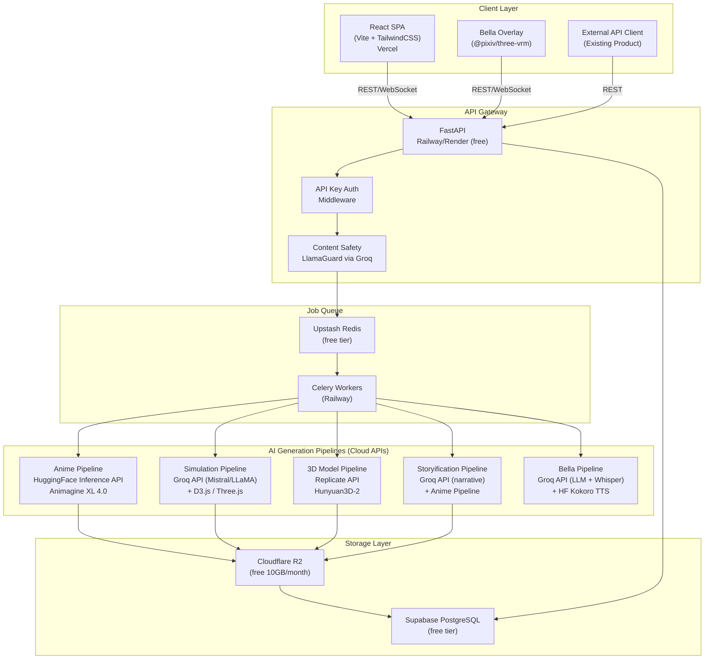
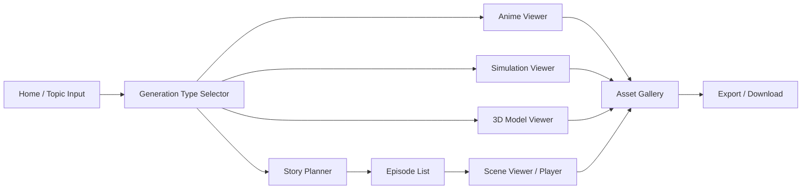

# Design Document: Education Anime Generator

## Overview

The Education Anime Generator is a full-stack, open-source AI platform that converts educational topics into anime-style visual content, interactive browser simulations, 3D models of real-world objects, and full storyified anime series. It is designed as a modular, API-first system that can be embedded into or integrated with an existing LMS or product.

**Architecture Philosophy (No-GPU, Solo-Developer Friendly):**
All heavy AI inference is offloaded to free/low-cost cloud APIs (Hugging Face Inference API, Replicate, Groq). The backend is lightweight Python (FastAPI) and can run on any laptop or a free-tier cloud VM (Railway, Render, or Fly.io). No local GPU is required.

The system is composed of five major subsystems:
1. **Anime Generation Pipeline** — text-to-image via Hugging Face Inference API (Animagine XL 4.0)
2. **Simulation Engine** — LLM-driven code generation via Groq API (Mistral/LLaMA, free tier)
3. **3D Model Engine** — text-to-3D via Replicate API (Hunyuan3D-2 or Shap-E)
4. **Storyification Engine** — LLM narrative planner (Groq) + sequential scene generator
5. **API + Job Queue** — FastAPI backend with Celery/Redis async job processing

---

## Architecture



---

## Tech Stack

| Layer | Technology | License | Hosting | Quality Note |
|---|---|---|---|---|
| Frontend | React 18 + Vite + TailwindCSS | MIT | Vercel (free) | — |
| 3D Viewer | Three.js + @react-three/fiber | MIT | Browser | — |
| Simulation Renderer | D3.js, Matter.js, Three.js | MIT | Browser | — |
| API Server | FastAPI (Python 3.11) | MIT | Railway / Render (free tier) | — |
| Job Queue | Celery 5 + Redis 7 | BSD | Upstash Redis (free tier) | — |
| Anime Image Gen | Animagine XL 4.0 + FLUX.1-dev | Apache 2.0 | Fal.ai API (best quality, ~$0.003/image) | Highest quality open-source |
| LLM (Narrative + Sim) | LLaMA 3.3 70B via Groq | Apache 2.0 | Groq API (free tier, 70B model) | Best open-source LLM |
| 3D Generation | Hunyuan3D-2.1 | Apache 2.0 | Fal.ai API (~$0.05/model) | Best open-source 3D |
| Bella TTS | Kokoro TTS v1.0 | Apache 2.0 | Fal.ai API (highest quality voice) | Best open-source TTS |
| Bella STT | Whisper Large v3 | MIT | Groq API (free tier) | Best open-source STT |
| Content Safety | LlamaGuard 3 8B | Llama 3 Community | Groq API (free tier) | — |
| Object Store | Cloudflare R2 (S3-compatible) | — | Free (10GB/month) | — |
| Database | Supabase PostgreSQL | Apache 2.0 | Supabase (free tier) | — |
| Container | Docker + Docker Compose | Apache 2.0 | Local dev only | — |
| API Docs | OpenAPI 3.0 (FastAPI auto-gen) | — | Bundled | — |

**Quality note:** The same model weights run on Fal.ai/Groq servers as would run on a local GPU. Quality is identical to a self-hosted setup — you get full production quality without owning hardware.

**Monthly cost estimate for solo developer:** ~$5-20/month depending on usage (Fal.ai charges per generation, Groq LLM/STT is free tier).

---

## Components and Interfaces

### 1. FastAPI Gateway (`/api/v1/`)

Handles all inbound HTTP requests. Validates API keys, runs safety pre-checks, enqueues jobs, and returns job IDs.

**Key Endpoints:**

| Method | Path | Description |
|---|---|---|
| POST | `/api/v1/generate/anime` | Submit anime scene/character generation job |
| POST | `/api/v1/generate/simulation` | Submit simulation generation job |
| POST | `/api/v1/generate/model3d` | Submit 3D model generation job |
| POST | `/api/v1/generate/story` | Submit storyification job |
| POST | `/api/v1/bella/chat` | Send message to Bella, get text + TTS audio |
| GET | `/api/v1/bella/history` | Get Bella conversation history for session |
| GET | `/api/v1/jobs/{job_id}` | Poll job status |
| GET | `/api/v1/jobs` | List last 50 jobs for session/API key |
| GET | `/api/v1/assets/{asset_id}` | Retrieve asset metadata + URL |
| DELETE | `/api/v1/assets/{asset_id}` | Delete asset |
| GET | `/api/v1/assets/{asset_id}/download` | Download asset file |
| GET | `/api/v1/openapi.json` | OpenAPI spec |
| POST | `/api/v1/webhooks/register` | Register webhook for job completion |

**Request/Response pattern (async job):**
```
POST /api/v1/generate/anime
→ 202 Accepted { "job_id": "uuid", "status": "queued" }

GET /api/v1/jobs/{job_id}
→ 200 OK { "job_id": "uuid", "status": "complete", "asset_id": "uuid", "asset_url": "..." }
```

### 2. Anime Generation Pipeline

Uses **Animagine XL 4.0** (anime-specialized) and **FLUX.1-dev** (highest quality) via **[Fal.ai API](https://fal.ai)** — same model weights as local GPU, full quality, no hardware needed.

**Flow:**
1. Receive topic + style parameters
2. Call Groq API (LLaMA 3.3 70B) to expand topic into a structured anime prompt
3. Call Fal.ai API with Animagine XL 4.0 (for anime style) or FLUX.1-dev (for photorealistic educational scenes)
4. Post-process: add caption overlay using Pillow
5. For animations: generate N frames, assemble into WebM via FFmpeg
6. Upload to Cloudflare R2, record metadata in Supabase

**Prompt Template (Mistral → Animagine):**
```
System: You are an anime art director for an educational platform.
User: Generate an anime image prompt for the topic: "{topic}"
Style: {style} (classroom|laboratory|outdoor|fantasy)
Output: A detailed Animagine XL prompt with character, setting, and educational element.
```

### 3. Simulation Engine

Uses **Groq API** (LLaMA 3.3 70B — free tier, extremely fast, highest quality open-source LLM) to generate simulation code.

**Flow:**
1. Receive topic + category (physics/chemistry/biology/math/history)
2. Call Groq API (LLaMA 3.3 70B) with a simulation code generation prompt
3. LLM outputs a self-contained HTML/JS simulation using D3.js, Matter.js, or Three.js
4. Validate output (syntax check, safety scan)
5. Package as self-contained HTML bundle
6. Upload to Cloudflare R2, return shareable URL

**Simulation Template Categories:**
- Physics: Matter.js rigid body simulations (gravity, collisions, pendulums)
- Chemistry: D3.js molecular diagrams + reaction animations
- Biology: D3.js cell diagrams, ecosystem simulations
- Mathematics: D3.js + math.js function plotters, geometry explorers
- History: Timeline visualizations with D3.js

### 4. 3D Model Engine

Uses **[Hunyuan3D-2.1](https://fal.ai/models/fal-ai/hunyuan3d-v2)** via **Fal.ai API** — Tencent's latest open-source 3D generation model with PBR textures, highest quality available.

**Flow:**
1. Receive object name + category
2. Call Groq API (LLaMA 3.3 70B) to generate a detailed object description prompt
3. Call Fal.ai API → Hunyuan3D-2.1 → returns GLTF URL with PBR textures
4. Download GLTF, upload to Cloudflare R2
5. Return asset URL for Three.js viewer

**Viewer:** `@react-three/fiber` + `@react-three/drei` GLTFLoader with orbit controls.

### 5. Storyification Engine

**Flow:**
1. Receive topic
2. Call Mistral 7B with a story planning prompt → returns JSON Story_Plan:
   ```json
   {
     "title": "...",
     "synopsis": "...",
     "characters": [{"name": "...", "role": "...", "description": "..."}],
     "episodes": [
       {
         "episode_number": 1,
         "title": "...",
         "educational_concept": "...",
         "scenes": [
           {"scene_number": 1, "description": "...", "caption": "..."}
         ]
       }
     ]
   }
   ```
3. For each scene in each episode: dispatch an Anime Pipeline job
4. Assemble completed scenes into episode bundles
5. Store Story_Plan JSON + all scene assets in MinIO
6. Return story manifest URL

### 6. Content Safety Filter

Uses **LlamaGuard 3 via Groq API** (free tier) for safety classification.

**Two-stage safety:**
- **Pre-generation:** Keyword blocklist + LlamaGuard on the topic/prompt (Groq API call)
- **Post-generation:** LlamaGuard on generated image captions and simulation code

### 7. Asset Manager

Supabase PostgreSQL schema + Cloudflare R2 integration for all asset CRUD operations.

### 8. Bella — 3D AI Learning Assistant

Bella is a persistent VRM-format anime humanoid avatar rendered in the browser using [@pixiv/three-vrm](https://github.com/pixiv/three-vrm) and `@react-three/fiber`. She acts as the student's personal AI companion throughout the LMS.

**Tech Stack for Bella:**
- **3D Rendering:** `@pixiv/three-vrm` + `@react-three/fiber` (Three.js, runs in browser)
- **VRM Model:** Open-source anime VRM model (e.g., from VRoid Hub under CC0/CC-BY license)
- **LLM Backend:** Groq API (LLaMA 3.3 70B — free tier, best quality open-source LLM)
- **TTS:** Kokoro TTS v1.0 via Fal.ai API (highest quality open-source voice synthesis)
- **STT:** Whisper Large v3 via Groq API (free tier, best open-source STT)
- **Lip Sync:** Viseme mapping from TTS phoneme output → VRM BlendShape targets

**Bella Pipeline Flow:**
```
User message (text or voice)
  → Groq Whisper Large v3 API (if voice input)
  → Groq API LLaMA 3.3 70B (Bella system prompt: educational assistant persona)
  → Fal.ai Kokoro TTS v1.0 API → audio buffer + phoneme timestamps
  → Viseme mapper → VRM BlendShape animation timeline
  → Play audio + animate Bella simultaneously
```

**Bella System Prompt Template:**
```
You are Bella, a friendly and knowledgeable anime-style AI learning assistant.
You help students understand educational topics in a warm, encouraging way.
Current topic context: {topic}
Current page: {page}
Keep responses concise (2-3 sentences) and educational.
```

**Bella Emotional States:**
| State | Trigger | VRM Animation |
|---|---|---|
| Neutral | Default / idle | Gentle breathing, eye blink |
| Thinking | Processing LLM response | Head tilt, finger to chin |
| Happy | Correct answer / content generated | Smile, small wave |
| Celebrate | Topic/episode completed | Jump, clap, sparkle effect |

**Bella UI Component:**
- Fixed bottom-right overlay panel (320×480px, collapsible)
- Three.js canvas for VRM rendering
- Chat bubble for text responses
- Microphone button for voice input
- Minimize/hide toggle

### 9. React SPA

Single-page application with these views:
- **Home / Topic Input** — topic entry, generation type selector
- **Generation Progress** — real-time job status via WebSocket
- **Anime Viewer** — scene gallery, animation player
- **Simulation Viewer** — embedded iframe simulation
- **3D Model Viewer** — Three.js orbit viewer
- **Story Player** — episode list + sequential scene viewer
- **Asset Gallery** — all generated assets for session
- **Export Panel** — ZIP download
- **Bella Overlay** — persistent across all views (bottom-right)

---

## Data Models

### Job

```python
class Job(BaseModel):
    job_id: UUID
    type: Literal["anime", "simulation", "model3d", "story"]
    status: Literal["queued", "processing", "complete", "failed"]
    topic: str
    parameters: dict          # style, category, episode_count, etc.
    asset_id: Optional[UUID]
    error_message: Optional[str]
    retry_count: int          # 0-3
    created_at: datetime
    updated_at: datetime
    session_id: str
    api_key: Optional[str]
```

### Asset

```python
class Asset(BaseModel):
    asset_id: UUID
    job_id: UUID
    type: Literal["image", "animation", "simulation", "model3d", "story"]
    topic: str
    file_path: str            # MinIO object key
    file_size_bytes: int
    mime_type: str
    metadata: dict            # captions, story_plan, object_name, etc.
    created_at: datetime
    expires_at: datetime      # created_at + 24h minimum
    session_id: str
```

### StoryPlan

```python
class StoryPlan(BaseModel):
    story_id: UUID
    title: str
    synopsis: str
    topic: str
    characters: List[Character]
    episodes: List[Episode]
    total_scenes: int
    status: Literal["planning", "generating", "complete", "failed"]

class Character(BaseModel):
    name: str
    role: str
    description: str
    asset_id: Optional[UUID]  # generated character image

class Episode(BaseModel):
    episode_number: int
    title: str
    educational_concept: str
    scenes: List[Scene]

class Scene(BaseModel):
    scene_number: int
    description: str
    caption: str
    asset_id: Optional[UUID]
    status: Literal["pending", "complete", "failed"]
```

### GenerationRequest (API input)

```python
class AnimeRequest(BaseModel):
    topic: str                          # max 500 chars
    style: Literal["classroom", "laboratory", "outdoor", "fantasy"] = "classroom"
    include_animation: bool = False
    character_name: Optional[str] = None

class SimulationRequest(BaseModel):
    topic: str
    category: Literal["physics", "chemistry", "biology", "mathematics", "history"]

class Model3DRequest(BaseModel):
    object_name: str
    category: Literal["anatomy", "chemistry", "astronomy", "historical", "mechanical"]

class StoryRequest(BaseModel):
    topic: str
    episode_count: int = Field(default=3, ge=1, le=10)
    reuse_character_id: Optional[UUID] = None
```

---

## UI/UX Design

### Design Principles
- Clean, modern dark theme with anime-inspired accent colors (purple, cyan, pink)
- Mobile-first responsive layout (min 320px)
- Progressive disclosure: simple input → rich output
- Real-time feedback at every step

### Screen Flow



### Key UI Components

**TopicInput** — Large centered input with placeholder "Enter a topic (e.g. Photosynthesis, Newton's Laws...)", generation type tabs (Anime / Simulation / 3D Model / Story), and a Generate button.

**JobProgressBar** — WebSocket-driven progress bar with status text ("Generating story plan...", "Rendering scene 2 of 9...").

**AnimeSceneCard** — Image card with caption overlay, download button, and "Add to Story" action.

**SimulationFrame** — Sandboxed iframe with fullscreen toggle and "Download HTML" button.

**ModelViewer3D** — `@react-three/fiber` canvas with orbit controls, zoom, pan, and "Download GLTF" button.

**StoryPlayer** — Left sidebar episode list + main scene viewer with Previous/Next navigation and caption display.

**AssetGallery** — Masonry grid of all session assets with filter by type and "Download All as ZIP" button.

---

## Correctness Properties

*A property is a characteristic or behavior that should hold true across all valid executions of a system — essentially, a formal statement about what the system should do. Properties serve as the bridge between human-readable specifications and machine-verifiable correctness guarantees.*

Property 1: Job ID uniqueness
*For any* two generation requests submitted to the system, the returned Job IDs must be distinct UUIDs.
**Validates: Requirements 4.2, 7.2**

Property 2: Job status progression is monotonic
*For any* Job, its status must only progress forward through the sequence: queued → processing → (complete | failed). It must never regress to a previous state.
**Validates: Requirements 4.5, 7.2**

Property 3: Asset retrieval round trip
*For any* successfully completed Job, the Asset stored in MinIO must be retrievable by its asset_id and must be byte-for-byte identical to what was stored. Any asset_id that does not exist must return HTTP 404.
**Validates: Requirements 6.1, 6.3**

Property 4: Asset deletion is permanent
*For any* deleted Asset, all subsequent GET requests for that asset_id must return HTTP 404, and the asset must not appear in any listing.
**Validates: Requirements 6.4, 6.5**

Property 5: Safety filter blocks unsafe topics pre-generation
*For any* topic string that contains a keyword from the blocklist, the system must reject the request before any Job is enqueued and return HTTP 422. No generation pipeline must be invoked.
**Validates: Requirements 8.4**

Property 6: Post-generation safety enforcement
*For any* generated asset that is classified as unsafe by the safety classifier, the Job must be marked "failed", the asset must not be stored or delivered, and a safety violation must be logged.
**Validates: Requirements 8.1, 8.2, 8.3**

Property 7: Story plan scene count invariant
*For any* generated StoryPlan with N episodes, each episode must contain at least 3 scenes, and the total scene count in the plan must equal the sum of scenes across all episodes.
**Validates: Requirements 9.2, 9.5**

Property 8: Simulation self-containment
*For any* generated simulation HTML bundle, it must be parseable as valid HTML5 and must not contain any src or href attributes pointing to external URLs (all resources must be inlined or data-URI encoded).
**Validates: Requirements 2.8**

Property 9: 3D model GLTF validity and texture completeness
*For any* generated 3D model asset, the file must be parseable as valid GLTF and all texture image references within the GLTF must resolve to embedded data without requiring external network requests.
**Validates: Requirements 3.1, 3.6**

Property 10: Retry count bounded
*For any* Job that has failed, the retry_count field must never exceed 3, and after 3 retries the Job status must be "failed".
**Validates: Requirements 7.3**

Property 11: Storage quota enforcement
*For any* session that has reached its configured storage quota, all subsequent generation requests must be rejected with HTTP 429 before any Job is enqueued or any pipeline is invoked.
**Validates: Requirements 6.6, 6.7**

Property 12: API job submission response time
*For any* valid generation request, the API must return a response containing a Job ID within 500 milliseconds of receiving the request.
**Validates: Requirements 4.2**

Property 13: Webhook delivery on job completion
*For any* Job with a registered webhook URL, when the Job transitions to "complete" or "failed", the system must attempt to deliver a POST notification to the registered URL containing the job_id and final status.
**Validates: Requirements 4.8**

Property 14: Asset metadata completeness
*For any* generated Asset (scene, simulation, 3D model, or story), its metadata record must contain non-empty values for: topic, generation type, timestamp, and type-specific fields (caption for scenes; object_name and description for 3D models; story_id for story scenes).
**Validates: Requirements 1.3, 3.4, 6.2**

Property 15: Asset availability window
*For any* completed Asset, the expires_at timestamp must be at least 24 hours after the created_at timestamp.
**Validates: Requirements 4.3**

Property 16: Malformed request returns structured 400
*For any* request body that fails schema validation, the API must return HTTP 400 with a response body containing a non-empty "details" array describing each validation failure.
**Validates: Requirements 4.9**

Property 17: Story ZIP manifest completeness
*For any* exported story ZIP archive, it must contain a parseable JSON manifest file that includes the story title, synopsis, episode list, and a reference to every scene asset file present in the archive.
**Validates: Requirements 9.8**

Property 18: Unauthenticated requests are rejected
*For any* request to a protected endpoint that does not include a valid API key, the system must return HTTP 401 before any processing or generation begins.
**Validates: Requirements 4.7**

Property 19: Prompt builder produces non-empty structured output
*For any* non-empty topic string, the prompt builder must return a non-empty string that contains the topic keywords and conforms to the Animagine XL prompt format (comma-separated tags).
**Validates: Requirements 1.2**

Property 20: Bella conversation history persistence
*For any* session, all messages sent to Bella and all of Bella's responses must be retrievable via the history endpoint in the same order they were exchanged, for the duration of the session.
**Validates: Requirements 10.11**

Property 21: Bella TTS fallback on failure
*For any* Bella response where TTS synthesis fails, the system must still return the text response with a non-empty message body and must not return an error status to the client.
**Validates: Requirements 10.12**

---

## CatchupXV1 Integration

The Education Anime Generator is designed to integrate seamlessly as a module inside the existing CatchupXV1 codebase. No separate deployment is needed.

### Integration Architecture

```
CatchupXV1/
├── backend/
│   └── app/
│       ├── routers/
│       │   ├── anime.py          ← NEW: anime generation endpoints
│       │   ├── simulation.py     ← NEW: simulation generation endpoints
│       │   ├── model3d.py        ← NEW: 3D model generation endpoints
│       │   ├── story.py          ← NEW: storyification endpoints
│       │   ├── anime_assets.py   ← NEW: asset management endpoints
│       │   └── bella.py          ← NEW: Bella assistant endpoints (extends existing chat.py pattern)
│       ├── services/
│       │   ├── anime_generator.py    ← NEW
│       │   ├── simulation_engine.py  ← NEW
│       │   ├── model3d_engine.py     ← NEW
│       │   ├── story_engine.py       ← NEW
│       │   └── asset_manager.py      ← NEW
│       ├── models/
│       │   └── anime_assets.py       ← NEW: SQLAlchemy models for jobs + assets
│       └── main.py               ← MODIFY: add new routers
└── catchupx-v1/
    └── app/
        ├── anime/
        │   └── page.tsx          ← NEW: Anime Generator page
        ├── simulation/
        │   └── page.tsx          ← NEW: Simulation page
        ├── model3d/
        │   └── page.tsx          ← NEW: 3D Model page
        └── story/
            └── page.tsx          ← NEW: Story Player page
    └── components/
        ├── anime/                ← NEW: AnimeViewer, SceneCard, etc.
        ├── simulation/           ← NEW: SimulationFrame
        ├── model3d/              ← NEW: ModelViewer3D
        ├── story/                ← NEW: StoryPlayer, EpisodeList
        └── bella/                ← NEW: BellaOverlay (extends existing 3D components)
```

### Backend Integration Steps

1. **Add new routers to `main.py`** — follow the exact same pattern as existing routers:
   ```python
   from app.routers import anime, simulation, model3d, story, anime_assets, bella
   app.include_router(anime.router, prefix="/api/v1/anime", tags=["anime"])
   app.include_router(simulation.router, prefix="/api/v1/simulation", tags=["simulation"])
   app.include_router(model3d.router, prefix="/api/v1/model3d", tags=["model3d"])
   app.include_router(story.router, prefix="/api/v1/story", tags=["story"])
   app.include_router(anime_assets.router, prefix="/api/v1/assets", tags=["assets"])
   app.include_router(bella.router, prefix="/api/v1/bella", tags=["bella"])
   ```

2. **Reuse existing infrastructure:**
   - `settings.GROQ_API_KEY` — already configured, reuse for LLaMA 3.3 70B calls
   - `settings.AI_MODEL` — already `"llama-3.3-70b-versatile"`, use as-is
   - `get_db()` dependency — reuse for all new SQLAlchemy models
   - JWT auth dependency — reuse `get_current_user` from existing `auth.py`
   - SQLite database — add new tables via SQLAlchemy models (auto-created on startup)

3. **Add new environment variables to `.env`:**
   ```
   FAL_API_KEY=your_fal_ai_key
   CLOUDFLARE_R2_ACCOUNT_ID=...
   CLOUDFLARE_R2_ACCESS_KEY=...
   CLOUDFLARE_R2_SECRET_KEY=...
   CLOUDFLARE_R2_BUCKET=catchupx-anime-assets
   ```

### Frontend Integration Steps

1. **Add new pages** under `catchupx-v1/app/` following Next.js App Router conventions
2. **Add navigation links** to the existing sidebar/nav component
3. **Reuse existing patterns:**
   - `AuthContext` — wrap new pages with existing auth context
   - `lib/api.ts` — add new API call functions following existing pattern
   - TailwindCSS classes — match existing design system
   - Framer Motion — use existing animation patterns
   - Three.js / `@react-three/fiber` — already installed, use for 3D viewer and Bella

4. **Bella overlay** — add to `app/layout.tsx` so it persists across all pages (same pattern as any global component in Next.js layout)

### No New Dependencies Needed (Backend)
The backend already has: `fastapi`, `sqlalchemy`, `groq` (via `httpx`), `pydantic`. Only additions needed:
- `fal-client` (Fal.ai SDK) — `pip install fal-client`
- `boto3` (for Cloudflare R2 S3-compatible API) — `pip install boto3`
- `celery[redis]` (optional, for async jobs) — `pip install celery redis`

### No New Dependencies Needed (Frontend)
The frontend already has: `three`, `@react-three/fiber`, `@react-three/drei`, `framer-motion`, `zustand`, `tailwindcss`. Only additions needed:
- `@pixiv/three-vrm` — `npm install @pixiv/three-vrm`
- `d3` — `npm install d3`
- `matter-js` — `npm install matter-js`

| Scenario | HTTP Status | Response Body |
|---|---|---|
| Malformed request body | 400 | `{ "error": "validation_error", "details": [...] }` |
| Missing/invalid API key | 401 | `{ "error": "unauthorized" }` |
| Unsafe topic (keyword) | 422 | `{ "error": "safety_violation", "reason": "..." }` |
| Storage quota exceeded | 429 | `{ "error": "quota_exceeded", "limit_bytes": N }` |
| Asset not found | 404 | `{ "error": "not_found", "asset_id": "..." }` |
| Generation timeout | Job "failed" | `{ "error": "timeout", "job_id": "..." }` |
| Safety classifier fail | Job "failed" | `{ "error": "safety_violation", "job_id": "..." }` |
| 3D model unavailable | Job "failed" | `{ "error": "model_unavailable", "suggestions": [...] }` |
| Simulation fallback | Job "complete" | Asset is text+diagram fallback, flagged in metadata |

All error responses include a `request_id` for tracing.

---

## Testing Strategy

### Dual Testing Approach

Both unit tests and property-based tests are required and complementary:
- Unit tests cover specific examples, integration points, and edge cases
- Property tests verify universal correctness across randomized inputs

### Property-Based Testing

Library: **Hypothesis** (Python) for backend, **fast-check** (TypeScript) for frontend.

Each property test runs a minimum of 100 iterations.

Tag format: `Feature: education-anime-generator, Property {N}: {property_text}`

| Property | Test Type | Library |
|---|---|---|
| P1: Job ID uniqueness | Property | Hypothesis |
| P2: Job status monotonic | Property | Hypothesis |
| P3: Asset round trip | Property | Hypothesis |
| P4: Asset deletion permanent | Property | Hypothesis |
| P5: Safety filter blocks | Property | Hypothesis |
| P6: Story plan scene count | Property | Hypothesis |
| P7: Simulation self-containment | Property | Hypothesis |
| P8: 3D model GLTF validity | Property | Hypothesis |
| P9: Retry count bounded | Property | Hypothesis |
| P10: Quota enforcement | Property | Hypothesis |
| P11: API response time | Property | Hypothesis + pytest-benchmark |
| P12: Webhook delivery | Property | Hypothesis |

### Unit Tests

- API endpoint contract tests (request/response shape)
- Prompt builder output validation (non-empty, contains topic keywords)
- Story plan JSON schema validation
- Asset metadata completeness checks
- Safety keyword blocklist coverage
- Simulation HTML output syntax validation

### Integration Tests

- Full job lifecycle: submit → poll → retrieve asset
- Storyification end-to-end: topic → story plan → scenes → player
- Webhook delivery end-to-end
- Storage quota enforcement flow
